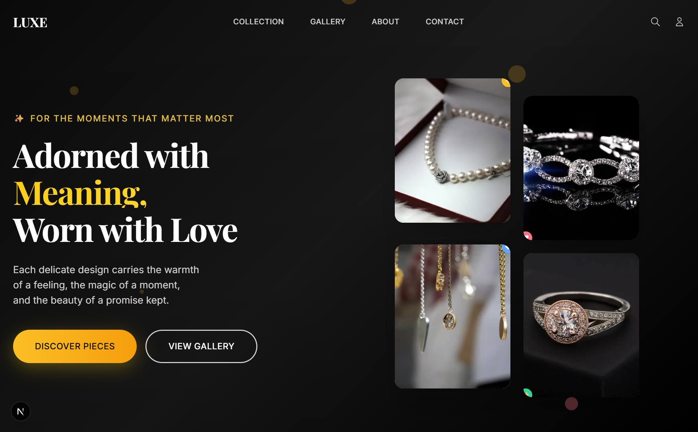

# ✨ Luxury Hero Section

A sophisticated, responsive hero section designed for luxury jewelry brands. Built with Next.js 15, TypeScript, Tailwind CSS, and GSAP animations to create an elegant, premium user experience.



## 🌟 Features

### **Design & Aesthetics**
- **Luxury Typography**: Playfair Display + Inter font pairing for elegant readability
- **Premium Color Palette**: Gold accents (#facc15) with sophisticated dark backgrounds
- **Responsive Design**: Perfect layout across desktop, tablet, and mobile devices
- **Glassmorphism Effects**: Subtle backdrop blur and transparency for modern luxury feel

### **Interactive Elements**
- **GSAP Animations**: Smooth, professional animations with fallback support
- **Hover Effects**: Elegant micro-interactions on buttons and images
- **Scroll-Based Navbar**: Transparent to opaque transition on scroll
- **Mobile-First Navigation**: Hamburger menu with smooth animations

### **Performance & SEO**
- **Next.js 15**: Latest features with App Router and Turbopack
- **Optimized Images**: Next.js Image component with Unsplash integration
- **Social Media Ready**: OpenGraph and Twitter Card metadata
- **Accessibility**: ARIA labels and semantic HTML structure

## 🚀 Quick Start

### Prerequisites
- Node.js 18+ 
- npm or yarn

### Installation

1. **Clone the repository**
   ```bash
   git clone https://github.com/keith-ufumeli/luxury-hero-section.git
   cd luxury-hero-section
   ```

2. **Install dependencies**
   ```bash
   npm install
   # or
   yarn install
   ```

3. **Run the development server**
   ```bash
   npm run dev
   # or
   yarn dev
   ```

4. **Open your browser**
   Navigate to [http://localhost:3000](http://localhost:3000)

## 🏗️ Project Structure

```
luxury-hero-section/
├── app/
│   ├── components/          # React components
│   │   ├── Navbar.tsx      # Luxury navigation bar
│   │   ├── HeroSection.tsx # Main hero component
│   │   ├── HeroText.tsx    # Text content component
│   │   ├── ImageGrid.tsx   # Image gallery component
│   │   ├── CTAButton.tsx   # Call-to-action buttons
│   │   └── DecorativeElements.tsx # Background decorations
│   ├── data/               # Content and configuration
│   │   └── heroContent.ts  # Hero section content
│   ├── lib/                # Utilities and helpers
│   │   ├── gsap.ts        # Animation utilities
│   │   └── utils.ts       # General utilities
│   ├── types/              # TypeScript type definitions
│   ├── globals.css         # Global styles and Tailwind
│   ├── fonts.ts           # Google Fonts configuration
│   ├── layout.tsx         # Root layout component
│   └── page.tsx           # Home page
├── public/                 # Static assets
├── tailwind.config.js      # Tailwind CSS configuration
├── next.config.ts         # Next.js configuration
└── package.json           # Dependencies and scripts
```

## 🎨 Customization

### **Content Updates**
Edit `app/data/heroContent.ts` to modify:
- Headlines and taglines
- Button text and links
- Image sources and descriptions
- Decorative elements

### **Styling**
- **Colors**: Update luxury color palette in `tailwind.config.js`
- **Typography**: Modify fonts in `app/fonts.ts`
- **Animations**: Customize GSAP animations in `app/lib/gsap.ts`

### **Images**
Replace Unsplash URLs in `heroContent.ts` with your own luxury jewelry images:
```typescript
src: "https://your-domain.com/path-to-image.jpg"
```

## 🛠️ Technologies Used

- **Framework**: [Next.js 15](https://nextjs.org/) with App Router
- **Language**: [TypeScript](https://www.typescriptlang.org/)
- **Styling**: [Tailwind CSS](https://tailwindcss.com/)
- **Animations**: [GSAP](https://greensock.com/gsap/)
- **Fonts**: [Google Fonts](https://fonts.google.com/) (Playfair Display + Inter)
- **Images**: [Unsplash](https://unsplash.com/) for high-quality stock photos

## 📱 Responsive Design

The hero section is fully responsive with breakpoints:
- **Mobile**: < 768px - Stacked layout with mobile navigation
- **Tablet**: 768px - 1024px - Optimized spacing and typography
- **Desktop**: > 1024px - Full luxury layout with side-by-side content

## 🎯 Key Components

### **Navbar**
- Fixed positioning with scroll-based transparency
- Responsive hamburger menu for mobile
- Luxury brand typography and spacing

### **Hero Section**
- Split layout: text content + image grid
- GSAP animations with fallback support
- Decorative background elements

### **Image Grid**
- 2x2 grid layout with hover effects
- Decorative icons and positioning
- Optimized image loading

### **CTA Buttons**
- Luxury gradient styling
- Hover animations and effects
- Accessible design patterns

## 🔧 Development

### **Available Scripts**
```bash
npm run dev      # Start development server
npm run build    # Build for production
npm run start    # Start production server
npm run lint     # Run ESLint
```


## 📄 License

This project is open source and available under the [MIT License](LICENSE).

## 🤝 Contributing

1. Fork the repository
2. Create your feature branch (`git checkout -b feature/amazing-feature`)
3. Commit your changes (`git commit -m 'Add amazing feature'`)
4. Push to the branch (`git push origin feature/amazing-feature`)
5. Open a Pull Request

## 📞 Support & Contact


- **Project Link**: [https://github.com/keith-ufumeli/luxury-hero-section](https://github.com/keith-ufumeli/luxury-hero-section)

## 🙏 Acknowledgments

- **Design Inspiration**: Luxury jewelry brands and premium web design trends, and Laiba UX/UI Designer [@laibacreatives](https://twitter.com/laibacreatives).
- **Icons**: Heroicons for clean, minimal iconography
- **Images**: Unsplash photographers for beautiful stock photography
- **Community**: Next.js and Tailwind CSS communities for excellent documentation

---

**Built with ❤️ for luxury brands that deserve exceptional digital experiences.**
